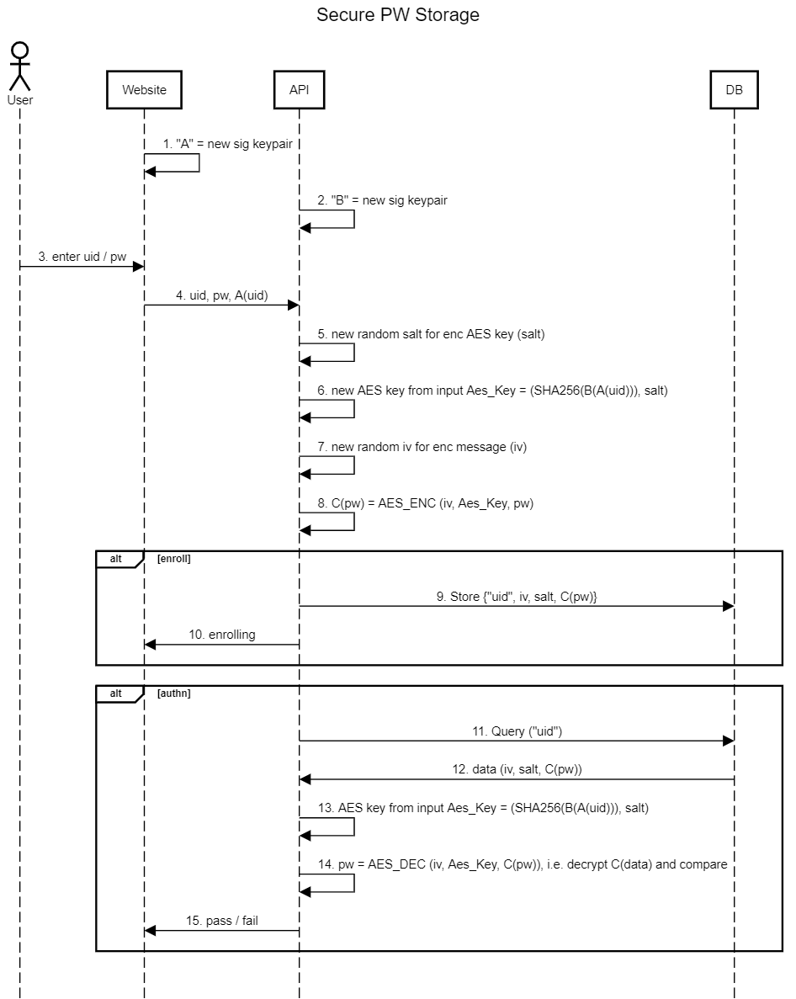

ReadMe (user documentation) file for the uid-pw-enc tool.
----------------------------------------

In this document user can find necessary info about usage of this uid-pw-enc
and reference of all functionality of this tool.

Features of the uid-pw-enc:
--------------------

    - Provides modeling of usage EC for signing/verifying (curve 'secp256r1') and encrypting/decrypting,
        uisng AES (mode: AES/GCM/NoPadding);
    - Generates EC keys in keystorages in PKCS12 format;
    - Generates AES keys from hash code (SHA-256) of signature;
    - Provides encryting/decrypting of a string data;
    - Implements follow alogorithm:
        - WebSite Object (A):
            - generates uid;
            - generates password;
            - generates own EC keypair ('secp256r1);
            - saves EC keypair in keystorage (PKCS12 format);
            - signs uid and returns the signature;

        - API Object (B):
            - generates own EC keypair ('secp256r1);
            - saves EC keypair in keystorage (PKCS12 format);
            - receives signature of uid from WebSite;
            - signs signature of uid received from WebSite, i.e. solving the B(A(uid));
            - initializes AES encrypter:
                - generates random salt (same for generated AES key), that is used by AES encrypter;
                - calculates hash code of generated signature by API object, i.e. B(A(uid));
                - initalizes AES key, using hash code of generated signature by API object, i.e. B(A(uid));
            - provides random iv (initializing vector) for every encrypting;
            - provides encrypting of random generated password (received from WebSite), using:
                - random salt (same for generated AES key);
                - AES key (obtained from hash code of generated signature by API object, i.e. B(A(uid)));
                - random iv;
            - provides decripting of random generated password (received from WebSite), using:
                - salt (same as during encrypting);
                - AES key (obtained from hash code of generated signature by API object, i.e. B(A(uid)));
                - iv (same as during encrypting);
                
        - Final outputs:
            - output of source password (in original format and in Base64 format);
            - output of encrypted password (in original format and in Base64 format);
            - output of decrypted password (in original format and in Base64 format);
            - generating result XML;
            - output result XML;            

Diagramm that shows implemented algorithm:
--------------------

Building uid-pw-enc binary files:
--------------------

    - run:
            install.bat
        or
            install.sh
        or
            mvn clean install
        ;
            
    - after success build follow file will be created:
                target/uid-pw-enc-distribution.zip
        this file contains distro, including necessary jars:
            - main module:
                uid-pw-enc.jar
            - crypto provider:
                bcpkix-jdk15on-1.70.jar
                bcprov-jdk15on-1.70.jar
                bcutil-jdk15on-1.70.jar
        ;

Launching uid-pw-enc:
-------------------

    for launching uid-pw-enc:
        - unpack somewhere file:
                target/uid-pw-enc-distribution.zip
        - run:
                run.bat
            or
                run.sh
        ;
    uid-pw-enc during execution creates log directory, that contains exec logs.
    
Example of log:
-------------------

2022-04-15 08:00:43.825 [main] INFO org.gluu.crypto.EncryptingUidPw - Application uid-pw-enc started...
2022-04-15 08:00:43.827 [main] INFO org.gluu.crypto.EncryptingUidPw - ------------------------
2022-04-15 08:00:43.827 [main] INFO org.gluu.crypto.EncryptingUidPw - > Creating WebSite Object:
2022-04-15 08:00:44.026 [main] INFO org.gluu.crypto.EncryptingUidPw - < WebSite Object has been created...
2022-04-15 08:00:44.026 [main] INFO org.gluu.crypto.EncryptingUidPw - > Creating API Object:
2022-04-15 08:00:44.087 [main] INFO org.gluu.crypto.EncryptingUidPw - < API Object has been created...
2022-04-15 08:00:44.087 [main] INFO org.gluu.crypto.EncryptingUidPw - ------------------------
2022-04-15 08:00:44.088 [main] INFO org.gluu.crypto.EncryptingUidPw - > Generating Uid and Password:
2022-04-15 08:00:44.090 [main] INFO org.gluu.crypto.EncryptingUidPw - Uid (Base64): NzY0MTM4OTk=
2022-04-15 08:00:44.091 [main] INFO org.gluu.crypto.EncryptingUidPw - Password (Base64): cyNmLWl1LWJYaHw4Jyo5WVMrNDJP
2022-04-15 08:00:44.091 [main] INFO org.gluu.crypto.EncryptingUidPw - < Uid and Password have been generated...
2022-04-15 08:00:44.091 [main] INFO org.gluu.crypto.EncryptingUidPw - ------------------------
2022-04-15 08:00:44.091 [main] INFO org.gluu.crypto.EncryptingUidPw - > WebSite Object: Generating EC signature keys:
2022-04-15 08:00:44.435 [main] INFO org.gluu.crypto.EncryptingUidPw - WebSite Ec Private Key (Base64) = MIGTAgEAMBMGByqGSM49AgEGCCqGSM49AwEHBHkwdwIBAQQgujR12Bu+n/jXceYlHfGQc50ydfPDCAnFQX0VonrN+GCgCgYIKoZIzj0DAQehRANCAAR2HZ5kcdK4N8VLfowOkp/Rg/UK7SQ+9c/AHcXsMVgdKVzXm6jBQ8iNfbsD20lrkVk7UoIiPjpoh+ZLzBm7Ff+x
2022-04-15 08:00:44.436 [main] INFO org.gluu.crypto.EncryptingUidPw - WebSite Ec Public Key (Base64) = MFkwEwYHKoZIzj0CAQYIKoZIzj0DAQcDQgAEdh2eZHHSuDfFS36MDpKf0YP1Cu0kPvXPwB3F7DFYHSlc15uowUPIjX27A9tJa5FZO1KCIj46aIfmS8wZuxX/sQ==
2022-04-15 08:00:44.436 [main] INFO org.gluu.crypto.EncryptingUidPw - < WebSite Object: EC signature keys have been generated...
2022-04-15 08:00:44.437 [main] INFO org.gluu.crypto.EncryptingUidPw - ------------------------
2022-04-15 08:00:44.437 [main] INFO org.gluu.crypto.EncryptingUidPw - > WebSite Object: Signing Uid:
2022-04-15 08:00:44.447 [main] INFO org.gluu.crypto.EncryptingUidPw - WebSite Object Signature (Base64) = MEUCIFhkiTcGn+JuOOP/lzZQaq8BJjhYXxwl9XjKCCKo1ifMAiEAj4zuzj581sWhxFKIK23XquA0xJUuKdb+dfZmuP++Ta0=
2022-04-15 08:00:44.447 [main] INFO org.gluu.crypto.EncryptingUidPw - < WebSite Object: Uid has been signed...
2022-04-15 08:00:44.447 [main] INFO org.gluu.crypto.EncryptingUidPw - ------------------------
2022-04-15 08:00:44.448 [main] INFO org.gluu.crypto.EncryptingUidPw - > WebSite Object: Verifying signature of Uid:
2022-04-15 08:00:44.459 [main] INFO org.gluu.crypto.EncryptingUidPw - WebSite Object Verifying = true
2022-04-15 08:00:44.460 [main] INFO org.gluu.crypto.EncryptingUidPw - < WebSite Object: Signature of Uid has been verified...
2022-04-15 08:00:44.460 [main] INFO org.gluu.crypto.EncryptingUidPw - ------------------------
2022-04-15 08:00:44.460 [main] INFO org.gluu.crypto.EncryptingUidPw - > API Object: Generating EC signature keys:
2022-04-15 08:00:44.557 [main] INFO org.gluu.crypto.EncryptingUidPw - API Ec Private Key (Base64) = MIGTAgEAMBMGByqGSM49AgEGCCqGSM49AwEHBHkwdwIBAQQgRUg7r3lq9O5EKfuiS1PtS1LdyCDqoLnQxNSisN57+BqgCgYIKoZIzj0DAQehRANCAAThD91JDJus1Ih9rOow17buYXeGdkYWTvua86r+vxdLyESatpSn20kPIx7RqIZR+2oGSf4vSmrNNLmz2iBczDwk
2022-04-15 08:00:44.558 [main] INFO org.gluu.crypto.EncryptingUidPw - API Ec Public Key (Base64) = MFkwEwYHKoZIzj0CAQYIKoZIzj0DAQcDQgAE4Q/dSQybrNSIfazqMNe27mF3hnZGFk77mvOq/r8XS8hEmraUp9tJDyMe0aiGUftqBkn+L0pqzTS5s9ogXMw8JA==
2022-04-15 08:00:44.568 [main] INFO org.gluu.crypto.EncryptingUidPw - API Object Signature (Base64) = MEUCIQDa+ARZX7bW0bzYuQKyOS3LIhswiAdQAQ11dMEVHBvEJwIgWJYhXcsuNt3/Hfk2zefW0V4wSKbm/68D/wcbOFSe7dQ=
2022-04-15 08:00:44.568 [main] INFO org.gluu.crypto.EncryptingUidPw - < API Object: EC signature keys have been generated...
2022-04-15 08:00:44.568 [main] INFO org.gluu.crypto.EncryptingUidPw - ------------------------
2022-04-15 08:00:44.568 [main] INFO org.gluu.crypto.EncryptingUidPw - > API Object: Verifying signature of WebSite Object signature:
2022-04-15 08:00:44.578 [main] INFO org.gluu.crypto.EncryptingUidPw - API Object Verifying = true
2022-04-15 08:00:44.578 [main] INFO org.gluu.crypto.EncryptingUidPw - < API Object: Signature of WebSite Object signature has been verified...
2022-04-15 08:00:44.578 [main] INFO org.gluu.crypto.EncryptingUidPw - ------------------------
2022-04-15 08:00:44.578 [main] INFO org.gluu.crypto.EncryptingUidPw - > API Object: Initializing AES key, salt:
2022-04-15 08:00:44.951 [main] INFO org.gluu.crypto.EncryptingUidPw - < API Object: AES key, salt have been initialized...
2022-04-15 08:00:44.952 [main] INFO org.gluu.crypto.EncryptingUidPw - ------------------------
2022-04-15 08:00:44.952 [main] INFO org.gluu.crypto.EncryptingUidPw - > API Object: Encrypting password:
2022-04-15 08:00:44.966 [main] INFO org.gluu.crypto.EncryptingUidPw - < API Object: Password has been encrypted...
2022-04-15 08:00:44.966 [main] INFO org.gluu.crypto.EncryptingUidPw - ------------------------
2022-04-15 08:00:44.967 [main] INFO org.gluu.crypto.EncryptingUidPw - > API Object: Back decrypting password:
2022-04-15 08:00:44.967 [main] INFO org.gluu.crypto.EncryptingUidPw - < API Object: Password has been decrypted...
2022-04-15 08:00:44.967 [main] INFO org.gluu.crypto.EncryptingUidPw - ------------------------
2022-04-15 08:00:44.967 [main] INFO org.gluu.crypto.EncryptingUidPw - AES Encrypting Data:
2022-04-15 08:00:44.967 [main] INFO org.gluu.crypto.EncryptingUidPw - src data (Base64) = cyNmLWl1LWJYaHw4Jyo5WVMrNDJP
2022-04-15 08:00:44.967 [main] INFO org.gluu.crypto.EncryptingUidPw - enc data (Base64) = krjrWphMdCH+gTDU3fVfw0jbUJC9u/CyyGcLfbfeKX73cEODAg==
2022-04-15 08:00:44.967 [main] INFO org.gluu.crypto.EncryptingUidPw - dec data (Base64) = cyNmLWl1LWJYaHw4Jyo5WVMrNDJP
2022-04-15 08:00:44.968 [main] INFO org.gluu.crypto.EncryptingUidPw - ------------------------
2022-04-15 08:00:44.968 [main] INFO org.gluu.crypto.EncryptingUidPw - password (Decoded) = s#f-iu-bXh|8'*9YS+42O
2022-04-15 08:00:44.968 [main] INFO org.gluu.crypto.EncryptingUidPw - src data (Decoded) = s#f-iu-bXh|8'*9YS+42O
2022-04-15 08:00:44.968 [main] INFO org.gluu.crypto.EncryptingUidPw - dec data (Decoded) = s#f-iu-bXh|8'*9YS+42O
2022-04-15 08:00:44.968 [main] INFO org.gluu.crypto.EncryptingUidPw - ------------------------
2022-04-15 08:00:45.021 [main] INFO org.gluu.crypto.EncryptingUidPw - Flow Data in XML format:
2022-04-15 08:00:45.021 [main] INFO org.gluu.crypto.EncryptingUidPw - xmlProcData = <proc_data><uid>NzY0MTM4OTk=</uid><password>cyNmLWl1LWJYaHw4Jyo5WVMrNDJP</password><web_site_ec_private_key>MIGTAgEAMBMGByqGSM49AgEGCCqGSM49AwEHBHkwdwIBAQQgujR12Bu+n/jXceYlHfGQc50ydfPDCAnFQX0VonrN+GCgCgYIKoZIzj0DAQehRANCAAR2HZ5kcdK4N8VLfowOkp/Rg/UK7SQ+9c/AHcXsMVgdKVzXm6jBQ8iNfbsD20lrkVk7UoIiPjpoh+ZLzBm7Ff+x</web_site_ec_private_key><web_site_ec_public_key>MFkwEwYHKoZIzj0CAQYIKoZIzj0DAQcDQgAEdh2eZHHSuDfFS36MDpKf0YP1Cu0kPvXPwB3F7DFYHSlc15uowUPIjX27A9tJa5FZO1KCIj46aIfmS8wZuxX/sQ==</web_site_ec_public_key><web_site_signature>MEUCIFhkiTcGn+JuOOP/lzZQaq8BJjhYXxwl9XjKCCKo1ifMAiEAj4zuzj581sWhxFKIK23XquA0xJUuKdb+dfZmuP++Ta0=</web_site_signature><api_ec_private_key>MIGTAgEAMBMGByqGSM49AgEGCCqGSM49AwEHBHkwdwIBAQQgRUg7r3lq9O5EKfuiS1PtS1LdyCDqoLnQxNSisN57+BqgCgYIKoZIzj0DAQehRANCAAThD91JDJus1Ih9rOow17buYXeGdkYWTvua86r+vxdLyESatpSn20kPIx7RqIZR+2oGSf4vSmrNNLmz2iBczDwk</api_ec_private_key><api_ec_public_key>MFkwEwYHKoZIzj0CAQYIKoZIzj0DAQcDQgAE4Q/dSQybrNSIfazqMNe27mF3hnZGFk77mvOq/r8XS8hEmraUp9tJDyMe0aiGUftqBkn+L0pqzTS5s9ogXMw8JA==</api_ec_public_key><api_signature>MEUCIQDa+ARZX7bW0bzYuQKyOS3LIhswiAdQAQ11dMEVHBvEJwIgWJYhXcsuNt3/Hfk2zefW0V4wSKbm/68D/wcbOFSe7dQ=</api_signature><enc_salt>dHFiZDZEeUo8MGw5JE0oWg==</enc_salt><secret_key>MEUCIFhkiTcGn+JuOOP/lzZQaq8BJjhYXxwl9XjKCCKo1ifMAiEAj4zuzj581sWhxFKIK23XquA0xJUuKdb+dfZmuP++Ta0=</secret_key><iv>I3lRd3R2TVUoKGZBXy1nQA==</iv><src_data>cyNmLWl1LWJYaHw4Jyo5WVMrNDJP</src_data><enc_data>krjrWphMdCH+gTDU3fVfw0jbUJC9u/CyyGcLfbfeKX73cEODAg==</enc_data><dec_data>cyNmLWl1LWJYaHw4Jyo5WVMrNDJP</dec_data></proc_data>
2022-04-15 08:00:45.022 [main] INFO org.gluu.crypto.EncryptingUidPw - ------------------------
2022-04-15 08:00:45.022 [main] INFO org.gluu.crypto.EncryptingUidPw - Application uid-pw-enc finished...
