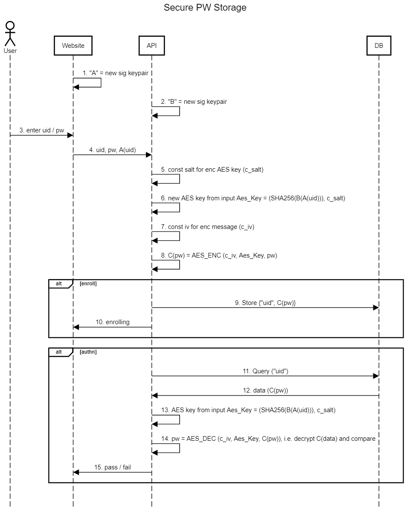

ReadMe (user documentation) file for the uid-pw-enc tool.
----------------------------------------

In this document user can find necessary info about usage of this uid-pw-enc
and reference of all functionality of this tool.

Features of the uid-pw-enc:
--------------------

    - Provides modeling of usage EC for signing/verifying (curve 'secp256r1') and encrypting/decrypting,
        uisng AES (mode: AES/GCM/NoPadding);
    - Generates EC keys in keystorages in PKCS12 format;
    - Generates AES keys from hash code (SHA-256) of signature;
    - Provides encryting/decrypting of a string data;
    - Implements follow alogorithm:
        - WebSite Object (A):
            - generates uid;
            - generates password;
            - generates own EC keypair ('secp256r1);
            - saves EC keypair in keystorage (PKCS12 format);
            - signs uid and returns the signature;

        - API Object (B):
            - generates own EC keypair ('secp256r1);
            - saves EC keypair in keystorage (PKCS12 format);
            - receives signature of uid from WebSite;
            - signs signature of uid received from WebSite, i.e. solving the B(A(uid));
            - initializes AES encrypter:
                - generates random salt (same for generated AES key), that is used by AES encrypter;
                - calculates hash code of generated signature by API object, i.e. B(A(uid));
                - initalizes AES key, using hash code of generated signature by API object, i.e. B(A(uid));
            - provides random iv (initializing vector) for every encrypting;
            - provides encrypting of random generated password (received from WebSite), using:
                - random salt (same for generated AES key);
                - AES key (obtained from hash code of generated signature by API object, i.e. B(A(uid)));
                - random iv;
            - provides decripting of random generated password (received from WebSite), using:
                - salt (same as during encrypting);
                - AES key (obtained from hash code of generated signature by API object, i.e. B(A(uid)));
                - iv (same as during encrypting);
                
        - Final outputs:
            - output of source password (in original format and in Base64 format);
            - output of encrypted password (in original format and in Base64 format);
            - output of decrypted password (in original format and in Base64 format);
            - generating result XML;
            - output result XML;

Diagram that shows implemented algorithm:
--------------------

Building uid-pw-enc binary files:
--------------------

    - run:
            install.bat
        or
            install.sh
        or
            mvn clean install
        ;
            
    - after success build follow file will be created:
                target/uid-pw-enc-distribution.zip
        this file contains distro, including necessary jars:
            - main module:
                uid-pw-enc.jar
            - crypto provider:
                bcpkix-jdk15on-1.70.jar
                bcprov-jdk15on-1.70.jar
                bcutil-jdk15on-1.70.jar
        ;

Launching uid-pw-enc:
-------------------

    for launching uid-pw-enc:
        - unpack somewhere file:
                target/uid-pw-enc-distribution.zip
        - run:
                run.bat
            or
                run.sh
        ;
    uid-pw-enc during execution creates log directory, that contains exec logs.
    
Example of log:
-------------------

    2022-04-21 16:45:38.154 [main] INFO org.gluu.crypto.EncryptingUidPw - Application uid-pw-enc started...
    2022-04-21 16:45:38.157 [main] INFO org.gluu.crypto.EncryptingUidPw - ------------------------
    2022-04-21 16:45:38.157 [main] INFO org.gluu.crypto.EncryptingUidPw - > Creating WebSite Object:
    2022-04-21 16:45:38.350 [main] INFO org.gluu.crypto.EncryptingUidPw - < WebSite Object has been created...
    2022-04-21 16:45:38.351 [main] INFO org.gluu.crypto.EncryptingUidPw - > Creating API Object:
    2022-04-21 16:45:38.403 [main] INFO org.gluu.crypto.EncryptingUidPw - < API Object has been created...
    2022-04-21 16:45:38.404 [main] INFO org.gluu.crypto.EncryptingUidPw - ------------------------
    2022-04-21 16:45:38.404 [main] INFO org.gluu.crypto.EncryptingUidPw - > Generating Uid and Password:
    2022-04-21 16:45:38.406 [main] INFO org.gluu.crypto.EncryptingUidPw - Uid (Base64): MzM3MjY1NjU=
    2022-04-21 16:45:38.407 [main] INFO org.gluu.crypto.EncryptingUidPw - Password (Base64): bThCJUo3M05Mfno8TFJJLUw2eEpa
    2022-04-21 16:45:38.407 [main] INFO org.gluu.crypto.EncryptingUidPw - < Uid and Password have been generated...
    2022-04-21 16:45:38.407 [main] INFO org.gluu.crypto.EncryptingUidPw - ------------------------
    2022-04-21 16:45:38.407 [main] INFO org.gluu.crypto.EncryptingUidPw - > WebSite Object: Generating EC signature keys:
    2022-04-21 16:45:38.748 [main] INFO org.gluu.crypto.EncryptingUidPw - WebSite Ec Private Key (Base64) = MIGTAgEAMBMGByqGSM49AgEGCCqGSM49AwEHBHkwdwIBAQQgkpL2wK0zDj0B8jOjrF6TuAqg3tCjdDQBCJf9EZaXMIigCgYIKoZIzj0DAQehRANCAATrmbliTkErqBDBFPggbDCkCfim0Sm8fr+SOlwFraCdDFwy5mPRn6thIVAWLCmfzut6UGHmkPbbJcM0JqqXC8AR
    2022-04-21 16:45:38.749 [main] INFO org.gluu.crypto.EncryptingUidPw - WebSite Ec Public Key (Base64) = MFkwEwYHKoZIzj0CAQYIKoZIzj0DAQcDQgAE65m5Yk5BK6gQwRT4IGwwpAn4ptEpvH6/kjpcBa2gnQxcMuZj0Z+rYSFQFiwpn87relBh5pD22yXDNCaqlwvAEQ==
    2022-04-21 16:45:38.749 [main] INFO org.gluu.crypto.EncryptingUidPw - < WebSite Object: EC signature keys have been generated...
    2022-04-21 16:45:38.749 [main] INFO org.gluu.crypto.EncryptingUidPw - ------------------------
    2022-04-21 16:45:38.749 [main] INFO org.gluu.crypto.EncryptingUidPw - > WebSite Object: Signing Uid:
    2022-04-21 16:45:38.760 [main] INFO org.gluu.crypto.EncryptingUidPw - WebSite Object Signature (Base64) = MEUCIAQVwkt/d11dgCpjkD7sJgHrn6gEcE8W7uL1NYzFXvwCAiEArZbFgxC6y8IDdclDKMEOJW1vgE9PHWYOMoEZrR4wGYw=
    2022-04-21 16:45:38.761 [main] INFO org.gluu.crypto.EncryptingUidPw - < WebSite Object: Uid has been signed...
    2022-04-21 16:45:38.761 [main] INFO org.gluu.crypto.EncryptingUidPw - ------------------------
    2022-04-21 16:45:38.761 [main] INFO org.gluu.crypto.EncryptingUidPw - > WebSite Object: Verifying signature of Uid:
    2022-04-21 16:45:38.772 [main] INFO org.gluu.crypto.EncryptingUidPw - WebSite Object Verifying = true
    2022-04-21 16:45:38.772 [main] INFO org.gluu.crypto.EncryptingUidPw - < WebSite Object: Signature of Uid has been verified...
    2022-04-21 16:45:38.772 [main] INFO org.gluu.crypto.EncryptingUidPw - ------------------------
    2022-04-21 16:45:38.772 [main] INFO org.gluu.crypto.EncryptingUidPw - > API Object: Generating EC signature keys:
    2022-04-21 16:45:38.867 [main] INFO org.gluu.crypto.EncryptingUidPw - API Ec Private Key (Base64) = MIGTAgEAMBMGByqGSM49AgEGCCqGSM49AwEHBHkwdwIBAQQguU2PWPIq97lL/3XtlATLaWPOEIgO/W3yf/Nw+ZxrHYmgCgYIKoZIzj0DAQehRANCAARUS5fGT17gv394V8H20KImO67aCDsovFqmJ6NxwQVj/eDkReZgKssEGaxxfKJ2ODZdS6ZZ2v90+9ZHPzx7pIui
    2022-04-21 16:45:38.867 [main] INFO org.gluu.crypto.EncryptingUidPw - API Ec Public Key (Base64) = MFkwEwYHKoZIzj0CAQYIKoZIzj0DAQcDQgAEVEuXxk9e4L9/eFfB9tCiJjuu2gg7KLxapiejccEFY/3g5EXmYCrLBBmscXyidjg2XUumWdr/dPvWRz88e6SLog==
    2022-04-21 16:45:38.877 [main] INFO org.gluu.crypto.EncryptingUidPw - API Object Signature (Base64) = MEQCIE9MKRq5GQ0ojnvdwOqkv27Wm0tgPXfFwgVl1HE7XWxyAiAyNBr3aSW/BttLaIR45J09p69UG8Ng03sqIMqgCvSxAA==
    2022-04-21 16:45:38.878 [main] INFO org.gluu.crypto.EncryptingUidPw - < API Object: EC signature keys have been generated...
    2022-04-21 16:45:38.878 [main] INFO org.gluu.crypto.EncryptingUidPw - ------------------------
    2022-04-21 16:45:38.878 [main] INFO org.gluu.crypto.EncryptingUidPw - > API Object: Verifying signature of WebSite Object signature:
    2022-04-21 16:45:38.888 [main] INFO org.gluu.crypto.EncryptingUidPw - API Object Verifying = true
    2022-04-21 16:45:38.888 [main] INFO org.gluu.crypto.EncryptingUidPw - < API Object: Signature of WebSite Object signature has been verified...
    2022-04-21 16:45:38.888 [main] INFO org.gluu.crypto.EncryptingUidPw - ------------------------
    2022-04-21 16:45:38.888 [main] INFO org.gluu.crypto.EncryptingUidPw - > API Object: Initializing AES key, salt:
    2022-04-21 16:45:39.243 [main] INFO org.gluu.crypto.EncryptingUidPw - < API Object: AES key, salt have been initialized...
    2022-04-21 16:45:39.244 [main] INFO org.gluu.crypto.EncryptingUidPw - ------------------------
    2022-04-21 16:45:39.244 [main] INFO org.gluu.crypto.EncryptingUidPw - > API Object: Encrypting password:
    2022-04-21 16:45:39.258 [main] INFO org.gluu.crypto.EncryptingUidPw - < API Object: Password has been encrypted...
    2022-04-21 16:45:39.258 [main] INFO org.gluu.crypto.EncryptingUidPw - ------------------------
    2022-04-21 16:45:39.258 [main] INFO org.gluu.crypto.EncryptingUidPw - > API Object: Back decrypting password:
    2022-04-21 16:45:39.258 [main] INFO org.gluu.crypto.EncryptingUidPw - < API Object: Password has been decrypted...
    2022-04-21 16:45:39.258 [main] INFO org.gluu.crypto.EncryptingUidPw - ------------------------
    2022-04-21 16:45:39.259 [main] INFO org.gluu.crypto.EncryptingUidPw - AES Encrypting Data:
    2022-04-21 16:45:39.260 [main] INFO org.gluu.crypto.EncryptingUidPw - src data (Base64) = bThCJUo3M05Mfno8TFJJLUw2eEpa
    2022-04-21 16:45:39.260 [main] INFO org.gluu.crypto.EncryptingUidPw - enc data (Base64) = wM76TUb8bn019gnAT6h0LminqWQeCpm84hMNJ/gHf/EXEUzyKg==
    2022-04-21 16:45:39.260 [main] INFO org.gluu.crypto.EncryptingUidPw - dec data (Base64) = bThCJUo3M05Mfno8TFJJLUw2eEpa
    2022-04-21 16:45:39.260 [main] INFO org.gluu.crypto.EncryptingUidPw - ------------------------
    2022-04-21 16:45:39.260 [main] INFO org.gluu.crypto.EncryptingUidPw - password (Decoded) = m8B%J73NL~z<LRI-L6xJZ
    2022-04-21 16:45:39.260 [main] INFO org.gluu.crypto.EncryptingUidPw - src data (Decoded) = m8B%J73NL~z<LRI-L6xJZ
    2022-04-21 16:45:39.261 [main] INFO org.gluu.crypto.EncryptingUidPw - dec data (Decoded) = m8B%J73NL~z<LRI-L6xJZ
    2022-04-21 16:45:39.261 [main] INFO org.gluu.crypto.EncryptingUidPw - ------------------------
    2022-04-21 16:45:39.312 [main] INFO org.gluu.crypto.EncryptingUidPw - Flow Data in XML format:
    2022-04-21 16:45:39.313 [main] INFO org.gluu.crypto.EncryptingUidPw - xmlProcData = <proc_data><uid>MzM3MjY1NjU=</uid><password>bThCJUo3M05Mfno8TFJJLUw2eEpa</password><web_site_ec_private_key>MIGTAgEAMBMGByqGSM49AgEGCCqGSM49AwEHBHkwdwIBAQQgkpL2wK0zDj0B8jOjrF6TuAqg3tCjdDQBCJf9EZaXMIigCgYIKoZIzj0DAQehRANCAATrmbliTkErqBDBFPggbDCkCfim0Sm8fr+SOlwFraCdDFwy5mPRn6thIVAWLCmfzut6UGHmkPbbJcM0JqqXC8AR</web_site_ec_private_key><web_site_ec_public_key>MFkwEwYHKoZIzj0CAQYIKoZIzj0DAQcDQgAE65m5Yk5BK6gQwRT4IGwwpAn4ptEpvH6/kjpcBa2gnQxcMuZj0Z+rYSFQFiwpn87relBh5pD22yXDNCaqlwvAEQ==</web_site_ec_public_key><web_site_signature>MEUCIAQVwkt/d11dgCpjkD7sJgHrn6gEcE8W7uL1NYzFXvwCAiEArZbFgxC6y8IDdclDKMEOJW1vgE9PHWYOMoEZrR4wGYw=</web_site_signature><api_ec_private_key>MIGTAgEAMBMGByqGSM49AgEGCCqGSM49AwEHBHkwdwIBAQQguU2PWPIq97lL/3XtlATLaWPOEIgO/W3yf/Nw+ZxrHYmgCgYIKoZIzj0DAQehRANCAARUS5fGT17gv394V8H20KImO67aCDsovFqmJ6NxwQVj/eDkReZgKssEGaxxfKJ2ODZdS6ZZ2v90+9ZHPzx7pIui</api_ec_private_key><api_ec_public_key>MFkwEwYHKoZIzj0CAQYIKoZIzj0DAQcDQgAEVEuXxk9e4L9/eFfB9tCiJjuu2gg7KLxapiejccEFY/3g5EXmYCrLBBmscXyidjg2XUumWdr/dPvWRz88e6SLog==</api_ec_public_key><api_signature>MEQCIE9MKRq5GQ0ojnvdwOqkv27Wm0tgPXfFwgVl1HE7XWxyAiAyNBr3aSW/BttLaIR45J09p69UG8Ng03sqIMqgCvSxAA==</api_signature><enc_salt>JDBhWDMjOkx5RTNNbUVxOQ==</enc_salt><secret_key>MEUCIAQVwkt/d11dgCpjkD7sJgHrn6gEcE8W7uL1NYzFXvwCAiEArZbFgxC6y8IDdclDKMEOJW1vgE9PHWYOMoEZrR4wGYw=</secret_key><iv>N1lGTSZ0SUpFQzluWixVKw==</iv><src_data>bThCJUo3M05Mfno8TFJJLUw2eEpa</src_data><enc_data>wM76TUb8bn019gnAT6h0LminqWQeCpm84hMNJ/gHf/EXEUzyKg==</enc_data><dec_data>bThCJUo3M05Mfno8TFJJLUw2eEpa</dec_data></proc_data>
    2022-04-21 16:45:39.313 [main] INFO org.gluu.crypto.EncryptingUidPw - ------------------------
    2022-04-21 16:45:39.314 [main] INFO org.gluu.crypto.EncryptingUidPw - Application uid-pw-enc finished...
